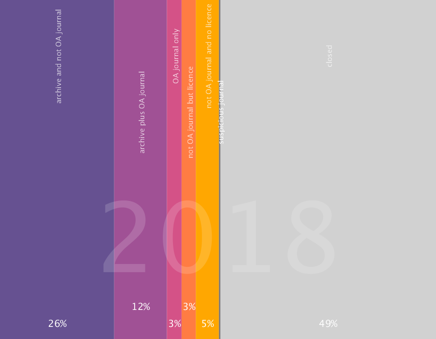

## Type d'accès ouvert des publications françaises de 2018 avec DOI

## Résultats bruts

publications dans archive ouverte & journal non open access : 39662 
publications dans archive ouverte & dans un journal open access : 18679 
publications hors archive ouverte & dans un journal open access : 5211 
publications hors archive ouverte & journal non open access mais avec licence ouverte : 5040 
publications hors archive ouverte & journal non open access & sans licence ouverte : 8167 
publications dans journaux suspects : 434 
publications en accès fermé : 77284 
nombre publications : 154477 

## Méthodologie

### Quelles sont les publications en compte ? 
Les publications identifiées par le [Baromètre français de la Science Ouverte](https://ministeresuprecherche.github.io/bso) (BSO), dont le repérage est basé sur l’identification du pays des affiliations des auteurs. Les bases sources utilisées par le BSO pour trouver ces publications sont Crossref et Hal. Seules les publications avec DOI (de Crossref) sont incluses.  

### Comment le type d'accès ouvert est-il obtenu ? 
A partir des données d’[Unpaywall](https://unpaywall.org/products/api). Ces données sont datées, elles ont été extraites à la fin du mois d'octobre 2020. 

### Comment l'identification des journaux suspects est-elle réalisée ? 
A partir de la liste [stop predatory journals partagée sur Github](https://github.com/stop-predatory-journals/stop-predatory-journals.github.io). L'identification se fait avec les ISSNs : pour chaque titre de la liste les ISSNs _print_ et _electronic_ ont été obtenus avec l'API de Crossref. Attention la précédente liste n'est plus mise à jour, prennez ces résultats à titre indicatifs.

### Circonspection : périmètre souhaité et outil utilisé 
Il faut distinguer le périmètre souhaité et celui couvert par l'outil employé. Le premier ne peut être équivalent au second. Par exemple on aimerait mesurer l'exhaustivité des publications françaises, mais l'outil utilisé couvre les publications avec DOI. Cela étant dit, en considérant la diversité du paysage des publications françaises, il faut d'une part se rendre compte qu'aucun outil ne permet d'atteindre "l'exhaustivité". D'autre part, la solution du BSO est une des plus pertinente car elle se passe des données des acteurs privées, en utilisant des données ouvertes (Crossref) et en les enrichissant avec des technologies de pointe.
 
Pour perfectionner l'outil, il serait souhaitable, pour une 2e version, d'intégrer les publications sans DOIs disponibles en accès ouvert dans HAL, avec au moins un auteur affilié à un établissement français.